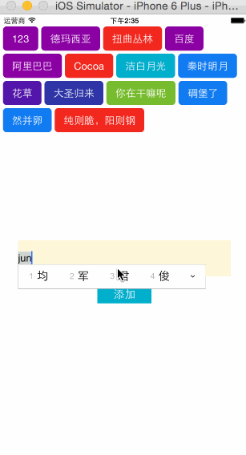

# CocoaTags
CocoaTags --标签展示
###效果展示


###使用方法
＝＝＝＝＝＝＝＝＝＝＝＝＝＝＝＝＝

###Platform file
```
platform :ios, '7.0'

pod 'CocoaTag', '~> 0.1.1'
```

＝＝＝＝＝＝＝＝＝＝＝＝＝＝＝＝＝


#### 1、根据数组初始化
 ```objective-c
  NSArray *array = @[@"123",@"德玛西亚",@"扭曲丛林",@"百度",@"阿里巴巴",@"Cocoa",@"洁白月光",@"秦时明月",@"花草",@"大圣归来",@"你在干嘛呢",@"碉堡了",@"然并卵",@"纯则脆，阳则钢"];
 CocoaTagView *tagsView = [[CocoaTagView alloc] initWithFrame:CGRectMake(0, 20,CGRectGetWidth(self.view.bounds), 200)];
    [self.view addSubview:tagsView];
    [tagsView setTagsWithTagsArray:array];

```

####2、增加tags

```onjective-c
  [_tagsView updateTags:array];
````

